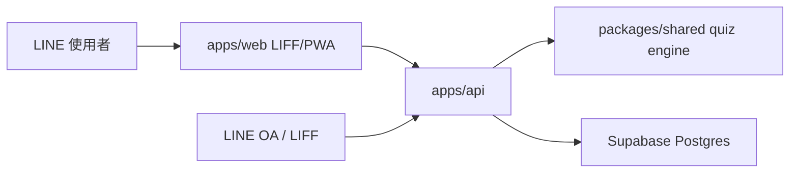

# AI 時代生存指數 Alpha 正式化架構

本階段目標是把目前可跑的 HTML Alpha，整理成未來可以正式接 LINE LIFF、LINE OA、Supabase、付款與部署的專案形狀。現有 `.dc.html` 原型先完整保留，不在這一輪拆掉。

## 目前保留區

根目錄的 HTML 原型仍是本機 Alpha 展示版：

- `AI時代生存指數.dc.html`
- `AI原型探索遊戲.dc.html`
- `AI原型演化結果.dc.html`
- `我的AI朋友圈.dc.html`
- `未來導航.dc.html`
- `support.js`
- `alpha-app.css`
- `data/archetypes.js`
- `assets/`

這些檔案繼續負責目前可看的 UX 與流程，不被正式化骨架直接取代。

## 新正式架構

```text
apps/
  web/          未來正式 LIFF/PWA 前端
  api/          未來正式 API 服務，負責 LINE、Supabase、分享、會員
packages/
  shared/       九大原型資料、測驗題目、計分引擎、共用型別
supabase/
  migrations/   資料庫 schema 與後續 migration
docs/
  architecture.md
  database-schema.md
```

## 邊界設計

### `apps/web`

前端只處理畫面、互動與 LIFF browser 行為。前端不直接保存 service role，不直接寫資料庫。

短期用途：

- 作為現有 HTML 原型搬遷到正式前端的目標位置
- 之後加入 LIFF SDK
- 呼叫 `apps/api` 儲存測驗結果與好友圈資料

### `apps/api`

API 是所有外部能力的集中入口。

預計負責：

- LINE LIFF user profile 驗證與同步
- LINE OA webhook
- 測驗答案儲存與計分
- Supabase 讀寫
- 分享事件紀錄
- 未來付款狀態同步

### `packages/shared`

共用資料與規則集中在這裡，避免前端、後端各自複製一份邏輯。

目前包含：

- 九大 AI 原型資料
- 6 題、每題 3 選項的測驗資料
- `scoreQuiz()` 計分引擎
- 共用 TypeScript 型別

## 資料流



## 本輪不做

- 不搬掉現有 HTML 原型
- 不接 LINE SDK
- 不接付款
- 不部署
- 不啟用 Supabase 專案連線
- 不做登入與會員正式流程

## 下一步建議

1. 用 `packages/shared` 取代 HTML 內重複的原型與測驗資料。
2. 把現有 HTML Alpha 的入口、測驗、結果、好友圈 UI 搬到 `apps/web`。
3. 在 `apps/api` 加入 Supabase client 與 quiz session service。
4. 建立 Supabase 專案後套用 `supabase/migrations`。
5. 最後才接 LINE LIFF 與 LINE OA webhook。
